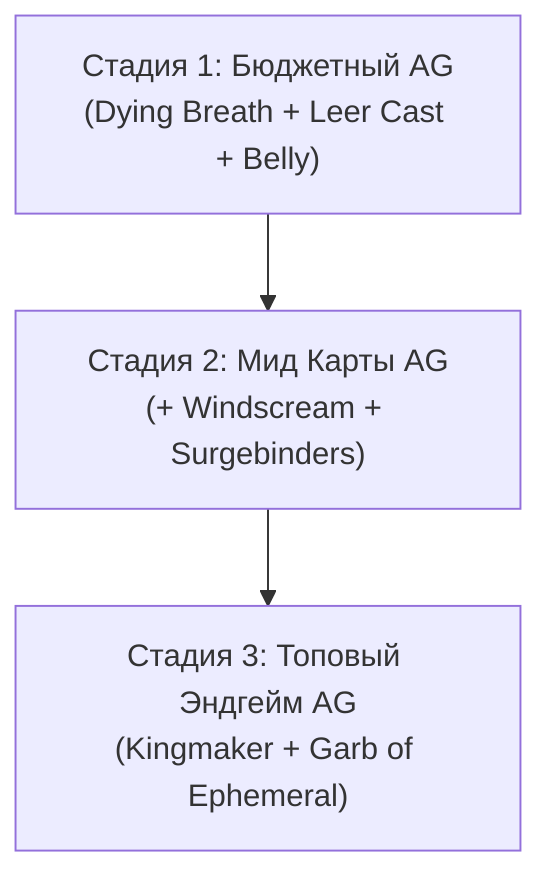

# Экипировка, Сборка Анимированного Хранителя (AG) и Крафт

В данном документе подробно разобран выбор предметов на **5 стадиях прогрессии**, полный гайд по шмоту для **Animate Guardian (Анимированного Хранителя)** и инструкции по эндгейм крафту.

---

## 5 Стадий Прогрессии Экипировки

### Стадия 1: Soulwrest Swap (Конец Кампании — 60+ Уровень)
- **Weapon 1**: `Soulwrest` (Ezomyte Staff) — 6 сокетов (линки не нужны!).
- **Weapon 1 Swap**: Второй посох `Soulwrest` (для мгновенной смены Зачистка / Соло-цель на кнопку 'X').
- **Helmet**: Редкая Praetor Crown или Armour/ES шлем с Здоровьем и Сопротивлениями.
- **Body Armour**: Редкая Vaal Regalia или Armour/ES Нагрудник (скрафтите жизнь, если на теле нет мода на HP для 15% life mastery).
- **Gloves**: Редкие Crusader Gloves (Armour/ES база) с HP и Сопротивлениями.
- **Boots**: Редкие Ботинки с 25%+ Movement Speed, HP и Сопротивлениями.
- **Belt**: `Darkness Enthroned` (Пояс бездны) с двумя самоцветами Ghastly Eye Jewels (Flat Minion Phys Damage + Cast Speed).
- **Amulet**: Редкий Agate Amulet с +1 к камням миньонов / всех камней или HP/Resists.

---

### Стадия 2: Red Maps (Ранние Eldritch свойства)
- **Helmet**: **Ancient Skull** (Bone Helmet)
  - *Ключевая механика*: Дает **50% increased Minion Damage** и **Minion Critical Strike Chance**, когда миньоны наносят критический удар.
- **Amulet**: **The Jinxed Juju** (Citrine Amulet)
  - *Ключевая механика*: 10% урона от получаемых ударов перенаправляется на ваших Спектров. Отличная защита на старте карт.
- **Eldritch свойства (Свойства Пожирателя/Пламенного)**:
  - Перчатки: Minion Damage / Exposure.
  - Ботинки: Movement Speed / Action Speed.

---

### Стадия 3: Late Red Maps (Поздние Красные Карты)
- **Flask 5**: **The Sorrow of the Divine** (Sulphur Flask)
  - *Ключевая механика*: Превращает реген здоровья от флаконов в **Energy Shield Recovery**. В связке с мгновенным Divine Life Flask дает панический мгновенный отхил ES!
- **Belt**: Улучшенный 75%+ `Darkness Enthroned` с топовыми Ghastly Eye самоцветами.

---

### Стадия 4: Late Red Maps (Переход в Bonemeld CI)
> [!IMPORTANT]
> **Условие перехода в Chaos Inoculation (CI)**: НЕ БЕРИТЕ нод CI, пока не надете амулет **Bonemeld** и не доведете стихийные резисты на шмоте до оверкапа!

- **Amulet**: **Bonemeld** (Уникальный Амулет)
  - *Ключевая польза*: Дает **+116% Global Defences** и **+2 к уровню всех Raise Spectre**, так как в вашей армии 22+ миньонов.
- **Keystone**: Перекачиваемся в **Chaos Inoculation (CI)** — 1 HP, 100% иммунитет к урону хаосом.
- **Body Armour**: Редкая Vaal Regalia с высоким Energy Shield (600+ ES) и мастери Броня/ES.

---

### Стадия 5: Топовый Эндгейм Сет (Endgame)
- **Weapon 1 (ST)**: `Soulwrest` (Идеальный ролл: +156 Flat Minion Phys, 29% Cast Speed, 127% Spell Damage).
- **Weapon 1 Swap (Clear)**: `Soulwrest` (Связка зачистки с `Annihilation Support` + `GMP`).
- **Amulet**: **Bonemeld** (+2 Spectre, высокий ролл).
- **Body Armour**: Топовый Vaal Regalia с двойными Eldritch свойствами (+1 Max Res, Minion Defense).
- **Rings**: Скрафченные кольца 3.29 (Flat Phys to Minions, Minion Damage, -Mana Cost of Non-Channeled Skills).
- **Jewels**: 4x Топовых Ghastly Eye самоцвета (+Flat Minion Phys, +Minion Cast Speed, +Energy Shield).

---

## Сборка Анимированного Хранителя (Animate Guardian / AG)

> [!TIP]
> **Как одевать Animate Guardian**: Сбросьте шмотки на землю в 1 Акте на локации *Coast* (зажмите ALT, если фильтр скрывает уники), наведите прицел на предмет на земле и примените скилл `Animate Guardian`. Одетое снаряжение **не выпадает при выходе из игры**, а в данном билде AG бессмертен!

### AG Тир 1: Бюджетный / Старт Карт
- **Оружие (Weapon)**: `Dying Breath` (Аура 18% Increased Damage + 18% Effect of Curses).
- **Шлем (Helmet)**: `Leer Cast` (Аура 50% Increased Damage для союзников).
- **Нагрудник (Body Armour)**: `Belly of the Beast` (Много здоровья для AG).
- **Перчатки (Gloves)**: Редкие Armour перчатки с резистами.
- **Ботинки (Boots)**: Редкие ботинки со скоростью бега.

### AG Тир 2: Средние Красные Карты
- **Оружие**: `Dying Breath`
- **Шлем**: `Leer Cast`
- **Нагрудник**: `Belly of the Beast`
- **Перчатки**: `Surgebinders` (Дает элементальный урон за заряды).
- **Ботинки**: `Windscream` (Позволяет Хранителю накладывать дополнительное проклятие).

### AG Тир 3: Лучший Эндгейм Сет (Best Endgame)
- **Оружие**: **Kingmaker** (Дает вам и всем миньонам **Fortify (Укрепление)**, +50% Crit Multiplier и **Culling Strike (Добивание)**!).
- **Шлем**: `Leer Cast`
- **Нагрудник**: **Garb of the Ephemeral** (Враги поблизости **НЕ Могут наносить критические удары**, а их скорость действий не может быть снижена ниже базовой).
- **Перчатки**: `Surgebinders`
- **Ботинки**: `Windscream`

---

## Гайд по крафту ключевых предметов

### 1. Новый крафт колец в 3.29
1. Купите базу **Unset Ring** или **Bone Ring** с высоким Energy Shield и сопротивлениями.
2. Прокрафтите сущностью **Deafening Essence of Fear** (Minion Damage) до получения высокого ES и резистов.
3. На верстаке накрафтите: `-7 to Non-Channelling Skills Mana Cost` или `Adds Physical Damage to Minions` (Новый мод 3.29).

### 2. Нагрудник с высоким Energy Shield
1. Возьмите **Vaal Regalia** (Ilvl 85+) или **Sadist Garb**.
2. Прокрафтите эссенциями Dense Essence до получения трех префиксов на ES (% ES, Flat ES, Hybrid ES).
3. Примените Eldritch угольки и ихоры для получения модов **Minion Damage** и **Determined Aura Effect**.
